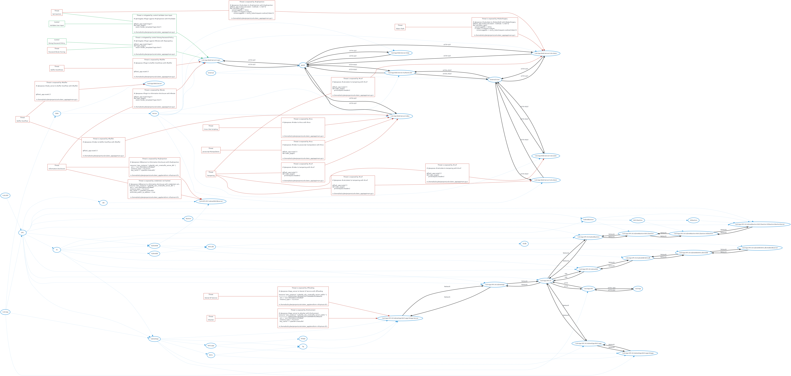

# Threatspec Project Threat Model

A threatspec project.


# Diagram



# Exposures

## Cross site scripting against CalcApp:Web:Server:Index
#xss

```
# @exposes #index to #xss with #xss


```
/home/kali/cyber/projects/calculator_app/app/main.py:1

## Buffer overflow against CalcApp:Web:Server:Index
#buffer

```
# @exposes #index to Buffer Overflow with #buffer


@flask_app.route('/')

```
/home/kali/cyber/projects/calculator_app/app/main.py:1

## Buffer overthrow against CalcApp:Web:Server:Login
#buffer

```
# @exposes #login to Buffer Overthrow with #buffer


@flask_app.route('/')

```
/home/kali/cyber/projects/calculator_app/app/main.py:1

## Buffer overflow against CalcApp:Web:Server
#buffer

```
# @exposes #web_server to Buffer Overflow with #buffer


@flask_app.route('/')

```
/home/kali/cyber/projects/calculator_app/app/main.py:1

## Javascript manipulation against CalcApp:Web:Server:Index
#xss

```
# @exposes #index to javascript manipulation with #xss


@flask_app.route('/')
def index_page():

```
/home/kali/cyber/projects/calculator_app/app/main.py:1

## Tampering against CalcApp:Web:Server:Index
#csrf

```
# @exposes #index to tampering with #csrf


@flask_app.route('/')
def index_page():
    print(request.headers)

```
/home/kali/cyber/projects/calculator_app/app/main.py:1

## Tampering against CalcApp:Web:Server:Calculate
#csrf

```
# @exposes #calculate to tampering with #csrf


@flask_app.route('/')
def index_page():
    print(request.headers)

```
/home/kali/cyber/projects/calculator_app/app/main.py:1

## Tampering against CalcApp:Web:Server:Calculate2
#csrf

```
# @exposes #calculate2 to tampering with #csrf


@flask_app.route('/')
def index_page():
    print(request.headers)

```
/home/kali/cyber/projects/calculator_app/app/main.py:1

## Tampering against CalcApp:Web:Server:Calculator
#csrf

```
# @exposes #calculator to tampering with #csrf


@flask_app.route('/')
def index_page():
    print(request.headers)

```
/home/kali/cyber/projects/calculator_app/app/main.py:1

## Information disclosure against CalcApp:Web:Server:Login
#brute

```
# @exposes #login to information disclosure with #brute

@flask_app.route('/login')
def login_page():
    return render_template('login.html')


```
/home/kali/cyber/projects/calculator_app/app/main.py:1

## Sql injection against CalcApp:Web:Server:Calculator
#sqlinjection

```
# @exposes #calculator to #sqlinjection with #sqlinjection
@flask_app.route('/calculator', methods = ['GET'])
def calculator_get():
    isUserLoggedIn = False
    if 'token' in request.cookies:
        isUserLoggedIn = verify_token(request.cookies['token'])

```
/home/kali/cyber/projects/calculator_app/app/main.py:1

## Token theft against CalcApp:Web:Server:Calculator
#tokenforgery

```
# @exposes #calculator to #tokentheft with #tokenforgery
@flask_app.route('/calculator', methods = ['GET'])
def calculator_get():
    isUserLoggedIn = False
    if 'token' in request.cookies:
        isUserLoggedIn = verify_token(request.cookies['token'])

```
/home/kali/cyber/projects/calculator_app/app/main.py:1

## Denial of service against CalcApp:VPC:IG:SubnetApp:NACLapp:SGapp:Server
#flooding

```
# @exposes #app_server to Denial of Service with #flooding

resource "aws_instance" "cyber94_calc_cmetcalfe_server_public" {
>>>>>>> 129f42520dc7d428d61397518046897bc096aac6
  ami = "ami-0943382e114f188e8"
  instance_type = "t2.micro"

```
/home/kali/cyber/projects/calculator_app/terraform-infra/main.tf:1

## Attacker against CalcApp:VPC:IG:SubnetApp:NACLapp:SGapp:Server
#sshconnect

```
# @exposes #app_server to attacker with #sshconnect
resource "aws_instance" "cyber94_calc_cmetcalfe_server_public" {
>>>>>>> 129f42520dc7d428d61397518046897bc096aac6
  ami = "ami-0943382e114f188e8"
  instance_type = "t2.micro"
  key_name = "cyber94-cmetcalfe"

```
/home/kali/cyber/projects/calculator_app/terraform-infra/main.tf:1

## Information disclosure against CalcAPP:VPC:SubnetDB:DBserver
#sqlinjection

```
# @exposes #dbserver to Information Disclosure with #sqlinjection

resource "aws_instance" "cyber94_calc_cmetcalfe_server_db" {
  ami = "ami-0943382e114f188e8"
  instance_type = "t2.micro"
  key_name = "cyber94-cmetcalfe"

```
/home/kali/cyber/projects/calculator_app/terraform-infra/main.tf:1

## Information disclosure against CalcAPP:VPC:SubnetDB:DBserver
Credentials not hashed

```
# @exposes #dbserver to information disclosure with credentials not hashed
resource "aws_instance" "cyber94_calc_cmetcalfe_server_db" {
  ami = "ami-0943382e114f188e8"
  instance_type = "t2.micro"
  key_name = "cyber94-cmetcalfe"
  associate_public_ip_address = true

```
/home/kali/cyber/projects/calculator_app/terraform-infra/main.tf:1


# Acceptances


# Transfers


# Mitigations

## Sql injection against CalcApp:Web:Server:Login mitigated by Validate user input


```
# @mitigates #login against #sqlinjection with #validate


@flask_app.route('/login')
def login_page():
    return render_template('login.html')

```
/home/kali/cyber/projects/calculator_app/app/main.py:1

## Password brute forcing against CalcApp:Web:Server:Login mitigated by Strong password policy


```
# @mitigates #login against #brute with #passpolicy

@flask_app.route('/login')
def login_page():
    return render_template('login.html')


```
/home/kali/cyber/projects/calculator_app/app/main.py:1


# Reviews


# Connections

## guest To CalcApp:Web:Server:Index
HTTP-GET

```
# @connects #guest to #index with HTTP-GET


```
/home/kali/cyber/projects/calculator_app/app/main.py:1

## CalcApp:Web:Server:Index To guest
HTTP-GET

```
# @connects #index to #guest with HTTP-GET


```
/home/kali/cyber/projects/calculator_app/app/main.py:1

## guest To CalcApp:Web:Server:Help
HTTP-GET

```
# @connects #guest to #help with HTTP-GET

@flask_app.route('/help')
def help_page():
    return "This is the help page"


```
/home/kali/cyber/projects/calculator_app/app/main.py:1

## CalcApp:Web:Server:Help To guest
HTTP-GET

```
# @connects #help to #guest with HTTP-GET

@flask_app.route('/help')
def help_page():
    return "This is the help page"


```
/home/kali/cyber/projects/calculator_app/app/main.py:1

## guest To CalcApp:Web:Server:Login
HTTP-GET

```
# @connects #guest to #login with HTTP-GET


@flask_app.route('/login')
def login_page():

```
/home/kali/cyber/projects/calculator_app/app/main.py:1

## CalcApp:Web:Server:Login To guest
HTTP-GET

```
# @connects #login to guest with HTTP-GET


@flask_app.route('/login')
def login_page():

```
/home/kali/cyber/projects/calculator_app/app/main.py:1

## guest To CalcApp:Web:Server:Authenticate
HTTP-POST

```
# @connects #guest to #authenticate with HTTP-POST


@flask_app.route('/authenticate', methods = ['POST'])
def authenticate_users():
    data = request.form

```
/home/kali/cyber/projects/calculator_app/app/main.py:1

## CalcApp:Web:Server:Authenticate With guest
HTTP-POST

```
# @connects #authenticate with #guest with HTTP-POST


@flask_app.route('/authenticate', methods = ['POST'])
def authenticate_users():
    data = request.form

```
/home/kali/cyber/projects/calculator_app/app/main.py:1

## External:User To CalcApp:Web:Server:Authenticate
HTTPs-POST

```
# @connects #user to #authenticate with HTTPs-POST

@flask_app.route('/authenticate', methods = ['POST'])
def authenticate_users():
    data = request.form
    username = data['username']

```
/home/kali/cyber/projects/calculator_app/app/main.py:1

## CalcApp:Web:Server:Authenticate To External:User
HTTPs-POST

```
# @connects #authenticate to #user with HTTPs-POST

@flask_app.route('/authenticate', methods = ['POST'])
def authenticate_users():
    data = request.form
    username = data['username']

```
/home/kali/cyber/projects/calculator_app/app/main.py:1

## guest To CalcApp:Web:Server:Calculator
HTTP-GET

```
# @connects #guest to #calculator with HTTP-GET


@flask_app.route('/calculator', methods = ['GET'])
def calculator_get():
    isUserLoggedIn = False

```
/home/kali/cyber/projects/calculator_app/app/main.py:1

## CalcApp:Web:Server:Calculator To guest
HTTP-GET

```
# @connects #calculator to #guest with HTTP-GET


@flask_app.route('/calculator', methods = ['GET'])
def calculator_get():
    isUserLoggedIn = False

```
/home/kali/cyber/projects/calculator_app/app/main.py:1

## External:User To CalcApp:Web:Server:Calculator
HTTP-GET

```
# @connects #user to #calculator with HTTP-GET

@flask_app.route('/calculator', methods = ['GET'])
def calculator_get():
    isUserLoggedIn = False
    if 'token' in request.cookies:

```
/home/kali/cyber/projects/calculator_app/app/main.py:1

## CalcApp:Web:Server:Calculator To External:User
HTTP-GET

```
# @connects #calculator to #user with HTTP-GET

@flask_app.route('/calculator', methods = ['GET'])
def calculator_get():
    isUserLoggedIn = False
    if 'token' in request.cookies:

```
/home/kali/cyber/projects/calculator_app/app/main.py:1

## External:User To CalcApp:Web:Server:Calculate
HTTP-POST

```
# @connects #user to #calculate with HTTP-POST

@flask_app.route('/calculate', methods = ['POST'])
def calculate_post():
    number_1 = request.form.get('number_1', type = int)
    number_2 = request.form.get('number_2', type = int)

```
/home/kali/cyber/projects/calculator_app/app/main.py:1

## CalcApp:Web:Server:Calculate To External:User
HTTP-POST

```
# @connects #calculate to #user with HTTP-POST

@flask_app.route('/calculate', methods = ['POST'])
def calculate_post():
    number_1 = request.form.get('number_1', type = int)
    number_2 = request.form.get('number_2', type = int)

```
/home/kali/cyber/projects/calculator_app/app/main.py:1

## External:User To CalcApp:Web:Server:Calculate2
HTTP-POST

```
# @connects #user to #calculate2 with HTTP-POST


@flask_app.route('/calculate2', methods = ['POST'])
def calculate_post2():
    print(request.form)

```
/home/kali/cyber/projects/calculator_app/app/main.py:1

## CalcApp:Web:Server:Calculate2 To External:User
HTTP-POST

```
# @connects #calculate2 to #user with HTTP-POST


@flask_app.route('/calculate2', methods = ['POST'])
def calculate_post2():
    print(request.form)

```
/home/kali/cyber/projects/calculator_app/app/main.py:1

## CalcApp To CalcApp:VPC
HTTP,SSH

```
# @connects #app to #vpc with HTTP,SSH

resource "aws_vpc" "cyber94_calc_cmetcalfe_vpc_tf" {
  cidr_block = "10.104.0.0/16"

  tags = {

```
/home/kali/cyber/projects/calculator_app/terraform-infra/main.tf:1

## CalcApp:VPC To CalcApp
HTTP, SSH

```
# @connects #vpc to #app with HTTP, SSH

resource "aws_vpc" "cyber94_calc_cmetcalfe_vpc_tf" {
  cidr_block = "10.104.0.0/16"

  tags = {

```
/home/kali/cyber/projects/calculator_app/terraform-infra/main.tf:1

## CalcApp:VPC To CalcApp:VPC:IG
HTTP

```
# @connects #vpc to #ig with HTTP
resource "aws_internet_gateway" "cyber94_calc_cmetcalfe_ig_tf" {
  vpc_id = aws_vpc.cyber94_calc_cmetcalfe_vpc_tf.id

  tags = {
    Name = "cyber94_calc_cmetcalfe_ig"

```
/home/kali/cyber/projects/calculator_app/terraform-infra/main.tf:1

## CalcApp:VPC:IG To CalcApp:VPC
HTTP

```
# @connects #ig to #vpc with HTTP
resource "aws_internet_gateway" "cyber94_calc_cmetcalfe_ig_tf" {
  vpc_id = aws_vpc.cyber94_calc_cmetcalfe_vpc_tf.id

  tags = {
    Name = "cyber94_calc_cmetcalfe_ig"

```
/home/kali/cyber/projects/calculator_app/terraform-infra/main.tf:1

## CalcApp:VPC:IG To CalcApp:VPC:IG:SubnetApp
Network

```
# @connects #ig to #subnet_app with Network
resource "aws_subnet" "cyber94_calc_cmetcalfe_subnet_public_tf" {
  vpc_id = aws_vpc.cyber94_calc_cmetcalfe_vpc_tf.id
  cidr_block = "10.104.1.0/24"

  tags = {

```
/home/kali/cyber/projects/calculator_app/terraform-infra/main.tf:1

## CalcApp:VPC:IG:SubnetApp To CalcApp:VPC:IG
Network

```
# @connects #subnet_app to #ig with Network
resource "aws_subnet" "cyber94_calc_cmetcalfe_subnet_public_tf" {
  vpc_id = aws_vpc.cyber94_calc_cmetcalfe_vpc_tf.id
  cidr_block = "10.104.1.0/24"

  tags = {

```
/home/kali/cyber/projects/calculator_app/terraform-infra/main.tf:1

## CalcApp:VPC:IG To CalcApp:VPC:IG:SubnetApp:NACLapp
Network

```
# @connects #ig to #nacl_app with Network
resource "aws_network_acl" "cyber94_calc_cmetcalfe_nacl_public_tf" {
  vpc_id = aws_vpc.cyber94_calc_cmetcalfe_vpc_tf.id

  ingress {
    protocol = "tcp"

```
/home/kali/cyber/projects/calculator_app/terraform-infra/main.tf:1

## CalcApp:VPC:IG:SubnetApp:NACLapp To CalcApp:VPC:IG
Network

```
# @connects #nacl_app to #ig with Network
resource "aws_network_acl" "cyber94_calc_cmetcalfe_nacl_public_tf" {
  vpc_id = aws_vpc.cyber94_calc_cmetcalfe_vpc_tf.id

  ingress {
    protocol = "tcp"

```
/home/kali/cyber/projects/calculator_app/terraform-infra/main.tf:1

## CalcApp:VPC:IG:SubnetApp:NACLapp To CalcApp:VPC:IG:SubnetApp:NACLapp:SGapp
Network

```
# @connects #nacl_app to #sg_app with Network

resource "aws_security_group" "cyber94_calc_cmetcalfe_sg_server_public_tf" {
  name = "cyber94_calc_cmetcalfe_sg_server_public"

  vpc_id = aws_vpc.cyber94_calc_cmetcalfe_vpc_tf.id

```
/home/kali/cyber/projects/calculator_app/terraform-infra/main.tf:1

## CalcApp:VPC:IG:SubnetApp:NACLapp:SGapp To CalcApp:VPC:IG:SubnetApp:NACLapp
Network

```
# @connects #sg_app to #nacl_app with Network

resource "aws_security_group" "cyber94_calc_cmetcalfe_sg_server_public_tf" {
  name = "cyber94_calc_cmetcalfe_sg_server_public"

  vpc_id = aws_vpc.cyber94_calc_cmetcalfe_vpc_tf.id

```
/home/kali/cyber/projects/calculator_app/terraform-infra/main.tf:1

## CalcApp:VPC:IG:SubnetApp To CalcApp:VPC:IG:SubnetApp:NACLapp:SGapp:Server
Network

```
# @connects #subnet_app to #app_server with Network


resource "aws_instance" "cyber94_calc_cmetcalfe_server_public" {
>>>>>>> 129f42520dc7d428d61397518046897bc096aac6
  ami = "ami-0943382e114f188e8"

```
/home/kali/cyber/projects/calculator_app/terraform-infra/main.tf:1

## CalcApp:VPC:IG:SubnetApp:NACLapp:SGapp:Server To CalcApp:VPC:IG:SubnetApp
Network

```
# @connects #app_server to #subnet_app with Network


resource "aws_instance" "cyber94_calc_cmetcalfe_server_public" {
>>>>>>> 129f42520dc7d428d61397518046897bc096aac6
  ami = "ami-0943382e114f188e8"

```
/home/kali/cyber/projects/calculator_app/terraform-infra/main.tf:1

## CalcApp:VPC:IG To CalcApp:VPC:IG:SubnetBastion
Network

```
# @connects #ig to #subnet_bastion with Network

resource "aws_subnet" "cyber94_calc_cmetcalfe_subnet_bastion_tf" {
  vpc_id = aws_vpc.cyber94_calc_cmetcalfe_vpc_tf.id
  cidr_block = "10.104.3.0/24"


```
/home/kali/cyber/projects/calculator_app/terraform-infra/main.tf:1

## CalcApp:VPC:IG:SubnetBastion To CalcApp:VPC:IG
Network

```
# @connects #subnet_bastion to #ig with Network

resource "aws_subnet" "cyber94_calc_cmetcalfe_subnet_bastion_tf" {
  vpc_id = aws_vpc.cyber94_calc_cmetcalfe_vpc_tf.id
  cidr_block = "10.104.3.0/24"


```
/home/kali/cyber/projects/calculator_app/terraform-infra/main.tf:1

## CalcApp:VPC:IG:SubnetBastion To CalcApp:VPC:IG:SubnetBastion:NACLbastion
Network

```
# @connects #subnet_bastion to #nacl_bastion with Network

resource "aws_network_acl" "cyber94_calc_cmetcalfe_nacl_bastion_tf" {
  vpc_id = aws_vpc.cyber94_calc_cmetcalfe_vpc_tf.id

  ingress {

```
/home/kali/cyber/projects/calculator_app/terraform-infra/main.tf:1

## CalcApp:VPC:IG:SubnetBastion:NACLbastion To CalcApp:VPC:IG:SubnetBastion
Network

```
# @connects #nacl_bastion to #subnet_bastion with Network

resource "aws_network_acl" "cyber94_calc_cmetcalfe_nacl_bastion_tf" {
  vpc_id = aws_vpc.cyber94_calc_cmetcalfe_vpc_tf.id

  ingress {

```
/home/kali/cyber/projects/calculator_app/terraform-infra/main.tf:1

## CalcApp:VPC:IG:SubnetBastion:NACLbastion To CalcApp:VPC:IG:SubnetBastion:NACLbastion:SGbastion
Network

```
# @connects #nacl_bastion to #sg_bastion with Network
resource "aws_security_group" "cyber94_calc_cmetcalfe_sg_server_bastion_tf" {
  name = "cyber94_calc_cmetcalfe_sg_server_bastion"

  vpc_id = aws_vpc.cyber94_calc_cmetcalfe_vpc_tf.id


```
/home/kali/cyber/projects/calculator_app/terraform-infra/main.tf:1

## CalcApp:VPC:IG:SubnetBastion:NACLbastion:SGbastion To CalcApp:VPC:IG:SubnetBastion:NACLbastion
Network

```
# @connects #sg_bastion to #nacl_bastion with Network
resource "aws_security_group" "cyber94_calc_cmetcalfe_sg_server_bastion_tf" {
  name = "cyber94_calc_cmetcalfe_sg_server_bastion"

  vpc_id = aws_vpc.cyber94_calc_cmetcalfe_vpc_tf.id


```
/home/kali/cyber/projects/calculator_app/terraform-infra/main.tf:1

## CalcApp:VPC:IG:SubnetBastion:NACLbastion:SGbastion To CalcApp:VPC:IG:SubnetBastion:NACLbastion:SGbastion:BastionServer
Network

```
# @connects #sg_bastion to #bastion_server with Network
resource "aws_instance" "cyber94_calc_cmetcalfe_server_bastion" {
  ami = "ami-0943382e114f188e8"
  instance_type = "t2.micro"
  key_name = "cyber94-cmetcalfe"
  associate_public_ip_address = true

```
/home/kali/cyber/projects/calculator_app/terraform-infra/main.tf:1

## CalcApp:VPC:IG:SubnetBastion:NACLbastion:SGbastion:BastionServer To CalcApp:VPC:IG:SubnetBastion:NACLbastion:SGbastion
Network

```
# @connects #bastion_server to #sg_bastion with Network
resource "aws_instance" "cyber94_calc_cmetcalfe_server_bastion" {
  ami = "ami-0943382e114f188e8"
  instance_type = "t2.micro"
  key_name = "cyber94-cmetcalfe"
  associate_public_ip_address = true

```
/home/kali/cyber/projects/calculator_app/terraform-infra/main.tf:1

## CalcApp:VPC:IG To CalcApp:VPC:IG:SubnetDB
SQL

```
# @connects #ig to #subnet_db with SQL

resource "aws_subnet" "cyber94_calc_cmetcalfe_subnet_db_tf" {
  vpc_id = aws_vpc.cyber94_calc_cmetcalfe_vpc_tf.id
  cidr_block = "10.104.2.0/24"


```
/home/kali/cyber/projects/calculator_app/terraform-infra/main.tf:1

## CalcApp:VPC:IG:SubnetDB To CalcApp:VPC:IG
SQL

```
# @connects #subnet_db to #ig with SQL

resource "aws_subnet" "cyber94_calc_cmetcalfe_subnet_db_tf" {
  vpc_id = aws_vpc.cyber94_calc_cmetcalfe_vpc_tf.id
  cidr_block = "10.104.2.0/24"


```
/home/kali/cyber/projects/calculator_app/terraform-infra/main.tf:1

## CalcApp:VPC:IG:SubnetDB To CalcApp:VPC:IG:SubnetDB:NACLdb
Network

```
# @connects #subnet_db to #nacl_db with Network

resource "aws_network_acl" "cyber94_calc_cmetcalfe_nacl_db_tf" {
  vpc_id = aws_vpc.cyber94_calc_cmetcalfe_vpc_tf.id

  ingress {

```
/home/kali/cyber/projects/calculator_app/terraform-infra/main.tf:1

## CalcApp:VPC:IG:SubnetDB:NACLdb To CalcApp:VPC:IG:SubnetDB
Network

```
# @connects #nacl_db to #subnet_db with Network

resource "aws_network_acl" "cyber94_calc_cmetcalfe_nacl_db_tf" {
  vpc_id = aws_vpc.cyber94_calc_cmetcalfe_vpc_tf.id

  ingress {

```
/home/kali/cyber/projects/calculator_app/terraform-infra/main.tf:1

## CalcApp:VPC:IG:SubnetDB:NACLdb To CalcApp:VPC:IG:SubnetDB:NACLdb:SGdb
Network

```
# @connects #nacl_db to #sg_db with Network
resource "aws_security_group" "cyber94_calc_cmetcalfe_sg_server_db_tf" {
  name = "cyber94_calc_cmetcalfe_sg_server_db"

  vpc_id = aws_vpc.cyber94_calc_cmetcalfe_vpc_tf.id


```
/home/kali/cyber/projects/calculator_app/terraform-infra/main.tf:1

## CalcApp:VPC:IG:SubnetDB:NACLdb:SGdb To CalcApp:VPC:IG:SubnetDB:NACLdb
Network

```
# @connects #sg_db to #nacl_db with Network
resource "aws_security_group" "cyber94_calc_cmetcalfe_sg_server_db_tf" {
  name = "cyber94_calc_cmetcalfe_sg_server_db"

  vpc_id = aws_vpc.cyber94_calc_cmetcalfe_vpc_tf.id


```
/home/kali/cyber/projects/calculator_app/terraform-infra/main.tf:1

## CalcApp:VPC:IG:SubnetDB:NACLdb:SGdb To CalcApp:VPC:IG:SubnetDB:NACLdb:SGdb:DBserver
Network

```
# @connects #sg_db to #db_server with Network


resource "aws_instance" "cyber94_calc_cmetcalfe_server_db" {
  ami = "ami-0943382e114f188e8"
  instance_type = "t2.micro"

```
/home/kali/cyber/projects/calculator_app/terraform-infra/main.tf:1

## CalcApp:VPC:IG:SubnetDB:NACLdb:SGdb:DBserver To CalcApp:VPC:IG:SubnetDB:NACLdb:SGdb
Network

```
# @connects #db_server to #sg_db with Network


resource "aws_instance" "cyber94_calc_cmetcalfe_server_db" {
  ami = "ami-0943382e114f188e8"
  instance_type = "t2.micro"

```
/home/kali/cyber/projects/calculator_app/terraform-infra/main.tf:1


# Components

## CalcApp:Web:Server:Login

## CalcApp:Web:Server:Index

## CalcApp:Web:Server

## CalcApp:Web:Server:Calculate

## CalcApp:Web:Server:Calculate2

## CalcApp:Web:Server:Calculator

## CalcApp:VPC:IG:SubnetApp:NACLapp:SGapp:Server

## CalcAPP:VPC:SubnetDB:DBserver

## guest

## CalcApp:Web:Server:Help

## CalcApp:Web:Server:Authenticate

## External:User

## CalcApp

## CalcApp:VPC

## CalcApp:VPC:IG

## CalcApp:VPC:IG:SubnetApp

## CalcApp:VPC:IG:SubnetApp:NACLapp

## CalcApp:VPC:IG:SubnetApp:NACLapp:SGapp

## CalcApp:VPC:IG:SubnetBastion

## CalcApp:VPC:IG:SubnetBastion:NACLbastion

## CalcApp:VPC:IG:SubnetBastion:NACLbastion:SGbastion

## CalcApp:VPC:IG:SubnetBastion:NACLbastion:SGbastion:BastionServer

## CalcApp:VPC:IG:SubnetDB

## CalcApp:VPC:IG:SubnetDB:NACLdb

## CalcApp:VPC:IG:SubnetDB:NACLdb:SGdb

## CalcApp:VPC:IG:SubnetDB:NACLdb:SGdb:DBserver


# Threats

## Sql injection


## Password brute forcing


## Cross site scripting


## Buffer overflow


## Buffer overthrow


## Javascript manipulation


## Tampering


## Information disclosure


## Token theft


## Denial of service


## Attacker


# Controls

## Validate user input

## Strong password policy
